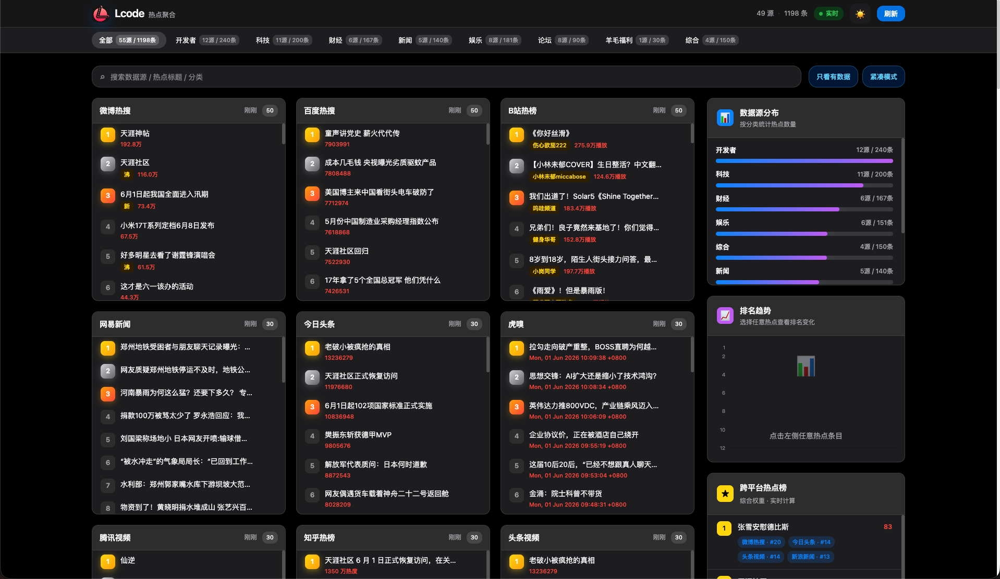

# 🔥 实时热点监控系统

一个实时聚合全网热点数据的监控系统，基于 Spring Boot + Vue 3 构建。当前已接入 **50+ 数据源**，覆盖综合热搜、新闻资讯、开发者社区、科技数码、财经、论坛、娱乐、游戏与羊毛福利等分类。



## ✨ 特性

- 🌐 **50+ 数据源聚合**：知乎、微博、百度、B站、GitHub、V2EX、少数派、虎嗅、Readhub、什么值得买等
- 🔎 **搜索与筛选**：支持按数据源、热点标题、分类搜索；支持“只看有数据”
- 🧱 **舒适 / 紧凑模式**：数据源多时可切换紧凑卡片，快速扫榜
- 📊 **趋势与统计**：排名趋势、跨平台热点榜、分类条形统计
- 🔄 **实时更新**：WebSocket 推送，支持手动刷新
- 🖱️ **桌面悬浮详情**：鼠标悬停可预览原文详情，移动端自动关闭预览
- 🌙 **深色模式**：支持浅色 / 深色主题切换
- 📱 **响应式适配**：支持桌面、平板、手机浏览

## 🚀 快速开始

### 前置要求

- Java 17+
- Maven 3.6+
- Node.js 16+
- npm 或 yarn

### 后端启动

```bash
cd backend
mvn spring-boot:run
```

后端默认启动在：

```text
http://localhost:8080
```

### 前端启动

```bash
cd frontend
npm install
npm run dev
```

前端默认启动在：

```text
http://localhost:5173
```

Vite 已配置代理，前端的 `/api` 和 `/ws` 会转发到本地后端。

### 生产构建

```bash
# 前端构建
cd frontend
npm run build

# 后端打包
cd ../backend
mvn clean package
java -jar target/hotdata-backend-1.0.0.jar
```

## 📁 项目结构

```text
hotdata/
├── backend/                 # Spring Boot 后端
│   ├── src/main/java/com/hotdata/
│   │   ├── config/          # 配置类
│   │   ├── controller/      # REST 控制器
│   │   ├── model/           # 数据模型
│   │   ├── service/         # 业务逻辑
│   │   ├── source/          # 数据源实现
│   │   ├── util/            # HTTP / FlareSolverr 工具
│   │   └── websocket/       # WebSocket 推送
│   └── pom.xml
├── frontend/                # Vue 3 前端
│   ├── public/              # 静态资源
│   ├── src/
│   │   ├── components/      # Vue 组件
│   │   ├── store/           # Pinia 状态管理
│   │   ├── App.vue          # 主应用
│   │   ├── main.js          # 入口文件
│   │   └── styles.css       # 全局样式
│   └── package.json
├── image.png                # 首页截图
└── README.md
```

## 🎯 支持的数据源

当前后端 `source` 目录中已接入 **54 个数据源**：

### 综合热搜

- 知乎热榜
- 微博热搜
- 百度热搜
- 微信读书

### 开发者 / 技术社区

- GitHub Trending
- Hacker News
- 掘金
- V2EX
- V2EX 热议
- CSDN 热榜
- InfoQ 中文
- SegmentFault
- 开源中国
- Product Hunt
- Lobsters
- DEV.to
- 阮一峰博客

### 科技 / 数码

- IT之家
- IT之家资讯
- IT之家 AI
- IT之家 Windows
- IT之家手机
- IT之家数码
- 少数派
- 小众软件
- Solidot
- Readhub
- 果核剥壳

### 新闻资讯

- 今日头条
- 新浪新闻
- 网易新闻
- 澎湃新闻
- 环球网

### 财经商业

- 36氪
- 同花顺
- 东方财富
- 华尔街见闻
- 网易财经

### 论坛 / 社区

- Linux.do
- Linux.do 热榜
- Linux.do 公益站
- NodeLoc
- AITO 论坛
- Chiphell
- 豆瓣小组

### 娱乐 / 视频 / 游戏

- B站热榜
- 抖音热榜
- 腾讯视频
- 头条视频
- 豆瓣电影
- Steam
- 机核
- 煎蛋热榜

### 羊毛福利

- 什么值得买

> 说明：部分站点可能会因反爬、网络、Cloudflare 或本地 FlareSolverr 未启动而短暂无数据。前端支持“只看有数据”来隐藏空源。

## 🎨 前端功能

### 首页看板

- 多列数据源卡片布局
- 有数据源优先排序
- 顶部分类导航显示 `源数量 / 热点数量`
- 搜索热点标题、平台名、分类
- 只看有数据
- 紧凑模式
- 分类数据条形统计
- 跨平台热点榜
- 单条热点排名趋势

### 桌面端交互

- 鼠标悬停热点条目显示详情卡片
- 优先 iframe 预览原文详情页
- 不支持 iframe 的站点自动降级为标题、热度、链接信息
- 悬浮卡片支持打开原文

### 移动端

- 单列自适应布局
- 横向滚动分类导航
- 自动关闭悬浮预览，避免触屏误触

## 🔧 配置

### 后端配置

配置文件：

```text
backend/src/main/resources/application.yml
```

主要配置：

```yaml
server:
  port: 8080

hotdata:
  fetch:
    interval-ms: 60000
    timeout-ms: 15000
  history:
    max-snapshots: 60
  proxy:
    enabled: true
    host: "127.0.0.1"
    port: 7897

flaresolverr:
  enabled: true
  url: "http://localhost:8191"
```

### 前端代理配置

配置文件：

```text
frontend/vite.config.js
```

```javascript
export default defineConfig({
  server: {
    port: 5173,
    proxy: {
      '/api': {
        target: 'http://localhost:8080',
        changeOrigin: true
      },
      '/ws': {
        target: 'ws://localhost:8080',
        ws: true,
        changeOrigin: true
      }
    }
  }
})
```

## 📊 API 文档

### 获取快照数据

```http
GET /api/hot/snapshot
```

### 获取单个平台数据

```http
GET /api/hot/board/{platform}
```

### 获取趋势数据

```http
GET /api/hot/trend?platform={platform}&title={title}
```

### 获取聚合排行

```http
GET /api/hot/aggregate?top=20
```

### 手动刷新

```http
GET /api/hot/refresh
POST /api/hot/refresh
```

### WebSocket

```text
ws://localhost:8080/ws/hotdata
```

## 🛠️ 技术栈

### 后端

- Spring Boot 3.2.5
- Spring WebFlux
- Spring WebSocket
- Jsoup
- Jackson
- Maven

### 前端

- Vue 3 Composition API
- Pinia
- ECharts
- Vite

## 🐛 故障排查

### 后端无法启动

- 检查端口：`lsof -i:8080`
- 检查 Java：`java -version`，需要 Java 17+
- 如果 Maven 依赖下载慢，先执行：`mvn -DskipTests compile`

### 前端无法连接后端

- 确认后端已启动在 `8080`
- 确认 Vite 代理配置正确
- 查看浏览器控制台和后端日志

### 部分数据源为空

- 站点反爬、Cloudflare 或网络超时会导致短暂失败
- Linux.do 等站点可能依赖 FlareSolverr
- 可以在前端开启“只看有数据”隐藏空源

## 📝 开发指南

### 添加新数据源

1. 在 `backend/src/main/java/com/hotdata/source/` 创建新类
2. 实现 `HotSource` 接口，或继承已有辅助类：
   - `RssHotSource`
   - `HtmlListSource`
   - `IthomeChannelSource`
3. 添加 `@Component` 注解
4. 实现平台标识、名称、分类和抓取逻辑
5. 至少连续测试 3 次成功后再保留

示例：

```java
@Component
public class NewSource implements HotSource {
    @Override
    public String platform() { return "new"; }

    @Override
    public String platformName() { return "新平台"; }

    @Override
    public String category() { return "tech"; }

    @Override
    public List<HotItem> fetch() throws Exception {
        // 实现数据抓取逻辑
    }
}
```

## 📄 许可证

仅供学习用途。

## 🙏 致谢

感谢所有数据源平台提供的公开数据。

---

**注意**：本项目仅用于学习交流，请遵守各平台的 robots.txt 和使用条款，不要高频抓取或用于商业用途。
